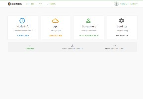
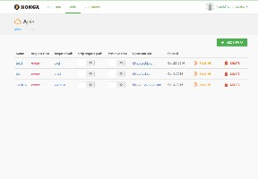
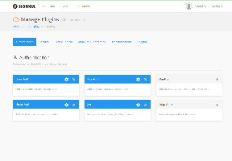
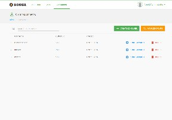
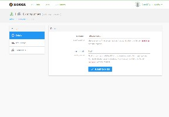
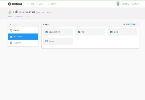

## Just another GUI to [KONG API Gateway](http://getkong.org)

## Summary

- [**Screenshots**](#screenshots)
- [**Features**](#features)
- [**Compatibility**](#compatibility)
- [**Prerequisites**](#prerequisites)
- [**Used libraries**](#used-libraries)
- [**Installation**](#installation)
- [**Configuration**](#configuration)
- [**Running Konga**](#running-konga)
- [**License**](#license)
    
    

## Screenshots

##### Admin Home
<kbd></kbd>

##### APIs Management
<kbd></kbd>   <kbd></kbd>  
<kbd></kbd>

##### Consumers Management
<kbd></kbd>  <kbd></kbd>  
<kbd></kbd>  <kbd></kbd>

## Features
* Manage APIs and plugins
* Manage consumers, groups and credentials
* Multiple nodes management
* GUI level authentication
* Multiple users (Only admin and user roles for now)

## Compatibility
Konga is built and tested on Kong 0.9.x but it probably works with older versions as well.
Feedback on older versions compatibility is welcome.

## Prerequisites
- A running [Kong installation](https://getkong.org/) 
- Nodejs
- Npm
- Gulp
- Bower

## Used libraries
* angular-sailsjs-boilerplate (awesome): https://github.com/tarlepp/angular-sailsjs-boilerplate
* Sails.js, http://sailsjs.org/
* AngularJS, https://angularjs.org/
* Bootstrap, http://getbootstrap.com/

## Installation

Install <code>npm</code> and <code>node.js</code>. Instructions can be found [here](http://sailsjs.org/#/getStarted?q=what-os-do-i-need).

Install <code>bower</code>, <code>gulp</code> and <code>sails</code> packages.
<pre>
$ npm install bower gulp sails -g
$ git clone https://github.com/pantsel/konga.git
$ cd konga
$ npm install
</pre>
This will install all frontend and backend dependencies. If for some reason this fails, 
try running <code>$ npm install</code> in /backend and /frontend separately

## Configuration
You can configure your <code>backend</code> and <code>frontend</code> applications to use your environment specified
settings. Basically by default you don't need to make any configurations at all. With default configuration backend will be run on http://localhost:1337 and frontend on http://localhost:3001 (development) http://localhost:3000 (production).

##### Backend
There is an example of backend configuration file on following path.

<pre>
/backend/config/local_example.js
</pre>

Just copy this to <code>/backend/config/local.js</code> and make necessary changes to it. Note that this
<code>local.js</code> file is in .gitignore so it won't go to VCS at any point.

##### Frontend
There is an example of front configuration file on following path.

<pre>
/frontend/config/config_example.json
</pre>

Just copy this to <code>/frontend/config/config.json</code> and make necessary changes to it. Note that this
<code>config.json</code> file is in .gitignore so it won't go to VCS at any point.

##### Notes
If you're changing your backend API url to another than <code>http://localhost:1337</code> you need to make
<code>frontend/config/config.json</code> with proper content on it. Use that example file as start.

## Running Konga

#### Development
<pre>
$ npm start
</pre>
Konga GUI is available at http://localhost:3001

You can also start frontend and backend separately
<pre>
$ cd frontend
$ gulp serve
</pre>
<pre>
$ cd backend
$ sails lift
</pre>

#### Production
<pre>
$ cd frontend
$ gulp dist
</pre>
This will create production-ready static code to frontend/dist ready to be served by any web server

<pre>
$ npm run production
</pre>
Konga GUI is available at http://localhost:3000

You can also start frontend and backend separately
<pre>
$ cd frontend
$ gulp production
</pre>
<pre>
$ cd backend
$ sails lift --prod
</pre>

#### Login
*Admin*
login: admin | password: adminadminadmin

*Demo user*
login: demo | password: demodemodemo

## ToDo
* Complete tests
* Include Logging & dynamic SSL plugins
* Write a detailed Wiki

## Author
Panagis Tselentis

## License
<pre>
The MIT License (MIT)
=====================

Copyright (c) 2015 Panagis Tselentis

Permission is hereby granted, free of charge, to any person obtaining a copy
of this software and associated documentation files (the "Software"), to deal
in the Software without restriction, including without limitation the rights
to use, copy, modify, merge, publish, distribute, sublicense, and/or sell
copies of the Software, and to permit persons to whom the Software is
furnished to do so, subject to the following conditions:

The above copyright notice and this permission notice shall be included in
all copies or substantial portions of the Software.

THE SOFTWARE IS PROVIDED "AS IS", WITHOUT WARRANTY OF ANY KIND, EXPRESS OR
IMPLIED, INCLUDING BUT NOT LIMITED TO THE WARRANTIES OF MERCHANTABILITY,
FITNESS FOR A PARTICULAR PURPOSE AND NONINFRINGEMENT. IN NO EVENT SHALL THE
AUTHORS OR COPYRIGHT HOLDERS BE LIABLE FOR ANY CLAIM, DAMAGES OR OTHER
LIABILITY, WHETHER IN AN ACTION OF CONTRACT, TORT OR OTHERWISE, ARISING FROM,
OUT OF OR IN CONNECTION WITH THE SOFTWARE OR THE USE OR OTHER DEALINGS IN
THE SOFTWARE.
</pre>
