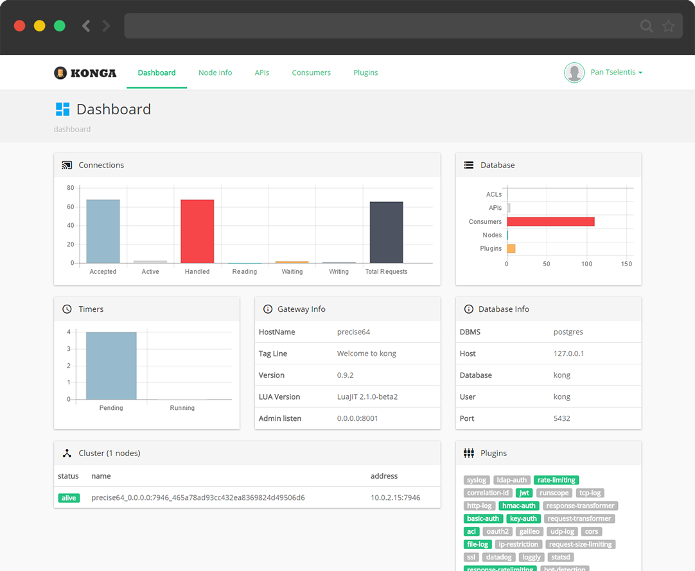

## More than just another GUI to [KONG Admin API](http://getkong.org)        

<em>Konga is not an official app. No affiliation with [Mashape](https://www.mashape.com/).</em>

[Site and working demo here](https://pantsel.github.io/konga/)

## Summary

- [**Discussions & Support**](#discussions--support)
- [**Features**](#features)
- [**Compatibility**](#compatibility)
- [**Prerequisites**](#prerequisites)
- [**Used libraries**](#used-libraries)
- [**Installation**](#installation)
- [**Configuration**](#configuration)
- [**Running Konga**](#running-konga)
- [**More Kong related stuff**](#more-kong-related-stuff)
- [**License**](#license)

## Discussions & Support
If you need to discuss anything Konga related, we have a chatroom on Gitter:

## Features
* Manage all Kong Admin API Objects.
* Import Consumers from remote sources (Databases, files, APIs etc.).
* Manage multiple Kong Nodes.
* Backup, restore and migrate Kong Nodes using Snapshots.
* Monitor Node and API states using health checks.
* Email notifications.
* Multiple users.
* Easy database integration (MySQL, postgresSQL, MongoDB, SQL Server).

## Compatibility
Konga is compatible with Kong 0.9.x,0.10.x

## Prerequisites
- A running [Kong installation](https://getkong.org/) 
- Nodejs
- Npm
- Gulp
- Bower

## Used libraries
* Sails.js, http://sailsjs.org/
* AngularJS, https://angularjs.org/
* Bootstrap, http://getbootstrap.com/

## Installation

Install <code>npm</code> and <code>node.js</code>. Instructions can be found [here](http://sailsjs.org/#/getStarted?q=what-os-do-i-need).

Install <code>bower</code>, <code>gulp</code> and <code>sails</code> packages.
<pre>
$ npm install bower gulp sails -g
$ git clone https://github.com/pantsel/konga.git
$ cd konga
$ npm install
</pre>

## Configuration
You can configure your  application to use your environment specified
settings.

There is an example configuration file on following path.

<pre>
/config/local_example.js
</pre>

Just copy this to <code>/config/local.js</code> and make necessary changes to it. Note that this
<code>local.js</code> file is in .gitignore so it won't go to VCS at any point.

### Databases Integration

Konga is bundled with It's own persistence mechanism for storing users and configuration.

A local persistent object store is used by default, which works great as a bundled, starter database (with the strict caveat that it is for non-production use only).

The application also supports some of the most popular databases out of the box:

1. MySQL
2. MongoDB
3. PostgresSQL
4. SQL Server

In order to use them, in your <code>/config/local.js</code> replace
<pre>
models: {
    connection: process.env.DB_ADAPTER || 'localDiskDb',
}
</pre>
with
<pre>
models: {
    connection: process.env.DB_ADAPTER || 'the-name-of-adapter-you-wish-to-use', // 'mysql', 'mongo', 'sqlserver' or 'postgres'
}
</pre>

See [Sails adapters](http://sailsjs.com/documentation/concepts/extending-sails/adapters/available-adapters) for further configuration

***************************************************************************************** 
##### Note : 
In case of <code>MySQL</code>, <code>PostgresSQL</code> or <code>SQL Server</code> adapters, 
you will need to create a database named <code>konga_database</code> manually and run the app in development mode the first time. 
<pre>npm start</pre>
Then kill the process and start Konga as you would in production mode.
Konga **will not** create the database or tables in production mode. 
***************************************************************************************** 

## Running Konga

### Development
<pre>
$ npm start
</pre>
Konga GUI will be available at http://localhost:1337

### Production

<pre>
$ npm run production
</pre>
Konga GUI will be available at http://localhost:1337

### Production Docker Image

The following instructions assume that you have a running Kong instance following the
instructions from [Kong's docker hub](https://hub.docker.com/_/kong/)
<pre>
$ docker pull pantsel/konga
$ docker run -p 1337:1337 
             --link kong:kong
             --name konga
             -e "NODE_ENV=production" \ // or "development" | defaults to 'development'
             pantsel/konga
</pre>

#### To use one of the supported databases
<pre>
// As stated before, in case of 'postgres','sqlserver'  or 'mysql' adapters,
// the database defined in DB_DATABASE must be created manually and the app must 
// start in development mode the first time in order to be able to create the tables.
// You can do that by bashing into Konga's container and running 'node app.js --dev'.
// You may also need to add an extra link that points to your database container.
$ docker run -p 1337:1337 
             --link kong:kong \
             -e "DB_ADAPTER=the-name-of-the-adapter" \ // 'mongo','postgres','sqlserver'  or 'mysql'
             -e "DB_HOST=your-db-hostname" \
             -e "DB_PORT=your-db-port" \ // Defaults to the default db port
             -e "DB_USER=your-db-user" \ // Omit if not relevant
             -e "DB_PASSWORD=your-db-password" \ // Omit if not relevant
             -e "DB_DATABASE=your-db-name" \ // Defaults to 'konga_database'
             -e "NODE_ENV=production" \ // or 'development' | defaults to 'development'
             --name konga \
             pantsel/konga
</pre>

The GUI will be available at <code>http://{your server's public ip}:1337</code>
Login, go to settings -> new node and add http://kong:8001 for Kong Admin URL.

#### Login
*Admin*
login: admin | password: adminadminadmin

*Demo user*
login: demo | password: demodemodemo

### Upgrading
In some cases a newer version of Konga may introduce new db tables, collections or changed in schemas.
The only thing you need to do is to start Konga in dev mode once sto that the migrations may be applied.
Then stop the app and run it again on production mode.

## More Kong related stuff
- [**Kong Admin proxy**](https://github.com/pantsel/kong-admin-proxy)
- [**Kong Middleman plugin**](https://github.com/pantsel/kong-middleman-plugin)

## Author
Panagis Tselentis

## License
<pre>
The MIT License (MIT)
=====================

Copyright (c) 2015 Panagis Tselentis

THE SOFTWARE IS PROVIDED "AS IS", WITHOUT WARRANTY OF ANY KIND, EXPRESS OR
IMPLIED, INCLUDING BUT NOT LIMITED TO THE WARRANTIES OF MERCHANTABILITY,
FITNESS FOR A PARTICULAR PURPOSE AND NONINFRINGEMENT. IN NO EVENT SHALL THE
AUTHORS OR COPYRIGHT HOLDERS BE LIABLE FOR ANY CLAIM, DAMAGES OR OTHER
LIABILITY, WHETHER IN AN ACTION OF CONTRACT, TORT OR OTHERWISE, ARISING FROM,
OUT OF OR IN CONNECTION WITH THE SOFTWARE OR THE USE OR OTHER DEALINGS IN
THE SOFTWARE.
</pre>
