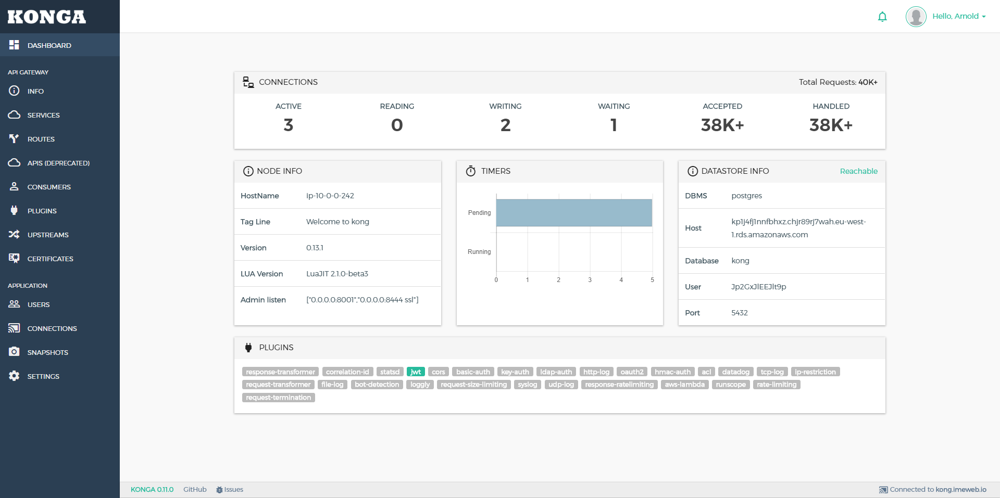

## More than just another GUI to [KONG Admin API](http://getkong.org)    [](https://travis-ci.org/pantsel/konga)    [](https://gitter.im/pantsel-konga/Lobby)


[](https://raw.githubusercontent.com/pantsel/konga/master/screenshots/bc2.png)

_Konga is not an official app. No affiliation with [Kong](https://www.konghq.com/)._

### Support the project
If you find Konga helpful, 
you can show your support and help me continue maintaining the project by [buying me a coffee](buymeacoff.ee/F1aRIj8CG)
or becoming a [Patron](https://www.patreon.com/kongaui). Cheers!

<a href="https://www.buymeacoffee.com/F1aRIj8CG" target="_blank"></a>


## Supported by

Special thanks to our supporters that help us keep the project going and the motivation alive.

<a href="https://www.greenbird.com" target="_blank"></a>

## Summary

- [**Discussions & Support**](#discussions--support)
- [**Features**](#features)
- [**Compatibility**](#compatibility)
- [**Prerequisites**](#prerequisites)
- [**Used libraries**](#used-libraries)
- [**Installation**](#installation)
- [**Configuration**](#configuration)
- [**Environment variables**](#environment-variables)
- [**Running Konga**](#running-konga)
- [**Upgrading**](#upgrading)
- [**FAQ**](#faq)
- [**More Kong related stuff**](#more-kong-related-stuff)
- [**License**](#license)

## Discussions & Support
If you need to discuss anything Konga related, we have a chatroom on Gitter:

[](https://gitter.im/pantsel-konga/Lobby)

## Features
* Manage all Kong Admin API Objects.
* Import Consumers from remote sources (Databases, files, APIs etc.).
* Manage multiple Kong Nodes.
* Backup, restore and migrate Kong Nodes using Snapshots.
* Monitor Node and API states using health checks.
* Email & Slack notifications.
* Multiple users.
* Easy database integration (MySQL, postgresSQL, MongoDB).

## Compatibility
**From 0.14.0 onwards, Konga is ONLY compatible with Kong 1.x**

If you're on an older Kong version , use [this](https://github.com/pantsel/konga/tree/legacy) branch 
or `konga:legacy` from docker hub instead.

## Prerequisites
- A running [Kong installation](https://getkong.org/) 
- Nodejs >= 8, <= 12.x (12.16 LTS is recommended)
- Npm

## Used libraries
* Sails.js, http://sailsjs.org/
* AngularJS, https://angularjs.org/

## Installation

Install `npm` and `node.js`. Instructions can be found [here](http://sailsjs.org/#/getStarted?q=what-os-do-i-need).

Install `bower`, ad `gulp` packages.
```
$ git clone https://github.com/pantsel/konga.git
$ cd konga
$ npm i
```

## Configuration
You can configure your  application to use your environment specified
settings.

There is an example configuration file on the root folder.

```
.env_example
```

Just copy this to `.env` and make necessary changes to it. Note that this
`.env` file is in .gitignore so it won't go to VCS at any point.

## Environment variables
These are the general environment variables Konga uses.

| VAR                | DESCRIPTION                                                                                                                | VALUES                                 | DEFAULT                                      |
|--------------------|----------------------------------------------------------------------------------------------------------------------------|----------------------------------------|----------------------------------------------|
| HOST               | The IP address that will be bind by Konga's server                                                                               | -                                      | '0.0.0.0'                                         |
| PORT               | The port that will be used by Konga's server                                                                               | -                                      | 1337                                         |
| NODE_ENV           | The environment                                                                                                            | `production`,`development`             | `development`                                |
| SSL_KEY_PATH       | If you want to use SSL, this will be the absolute path to the .key file. Both `SSL_KEY_PATH` & `SSL_CRT_PATH` must be set. | -                                      | null                                         |
| SSL_CRT_PATH       | If you want to use SSL, this will be the absolute path to the .crt file. Both `SSL_KEY_PATH` & `SSL_CRT_PATH` must be set. | -                                      | null                                         |
| KONGA_HOOK_TIMEOUT | The time in ms that Konga will wait for startup tasks to finish before exiting the process.                                | -                                      | 60000                                        |
| DB_ADAPTER         | The database that Konga will use. If not set, the localDisk db will be used.              | `mongo`,`mysql`,`postgres`     | -                                            |
| DB_URI             | The full db connection string. Depends on `DB_ADAPTER`. If this is set, no other DB related var is needed.                 | -                                      | -                                            |
| DB_HOST            | If `DB_URI` is not specified, this is the database host. Depends on `DB_ADAPTER`.                                          | -                                      | localhost                                    |
| DB_PORT            | If `DB_URI` is not specified, this is the database port.  Depends on `DB_ADAPTER`.                                         | -                                      | DB default.                                  |
| DB_USER            | If `DB_URI` is not specified, this is the database user. Depends on `DB_ADAPTER`.                                          | -                                      | -                                            |
| DB_PASSWORD        | If `DB_URI` is not specified, this is the database user's password. Depends on `DB_ADAPTER`.                               | -                                      | -                                            |
| DB_DATABASE        | If `DB_URI` is not specified, this is the name of Konga's db.  Depends on `DB_ADAPTER`.                                    | -                                      | `konga_database`                             |
| DB_PG_SCHEMA       | If using postgres as a database, this is the schema that will be used.                                                     | -                                      | `public`                                     |
| KONGA_LOG_LEVEL    | The logging level                                                                                                          | `silly`,`debug`,`info`,`warn`,`error`  | `debug` on dev environment & `warn` on prod. |
| TOKEN_SECRET       | The secret that will be used to sign JWT tokens issued by Konga | - | - |
| NO_AUTH            | Run Konga without Authentication                                                                                           | true/false                             | -                                         |
| BASE_URL           | Define a base URL or relative path that Konga will be loaded from. Ex: www.example.com/konga                               | <string>                                     | -                                         |
| KONGA_SEED_USER_DATA_SOURCE_FILE           | Seed default users on first run. [Docs](./docs/SEED_DEFAULT_DATA.md).                               | <string>                                     | -                                         |
| KONGA_SEED_KONG_NODE_DATA_SOURCE_FILE      | Seed default Kong Admin API connections on first run [Docs](./docs/SEED_DEFAULT_DATA.md)                               | <string>                                     | -                                         |


### Databases Integration

Konga is bundled with It's own persistence mechanism for storing users and configuration.

A local persistent object store is used by default, which works great as a bundled, starter database (with the strict caveat that it is for non-production use only).

The application also supports some of the most popular databases out of the box:

1. MySQL
2. MongoDB
3. PostgresSQL

In order to use them, set the appropriate env vars in your `.env` file.
 

## Running Konga

### Development
```
$ npm start
```
Konga GUI will be available at `http://localhost:1337`

### Production

***************************************************************************************** 
In case of `MySQL` or `PostgresSQL` adapters, Konga will not perform db migrations when running in production mode.

You can manually perform the migrations by calling ```$ node ./bin/konga.js  prepare``` 
, passing the args needed for the database connectivity.

For example: 

```
$ node ./bin/konga.js  prepare --adapter postgres --uri postgresql://localhost:5432/konga
```
The process will exit after all migrations are completed. 

*****************************************************************************************

Finally:
```
$ npm run production
```
Konga GUI will be available at `http://localhost:1337`


### Production Docker Image

The following instructions assume that you have a running Kong instance following the
instructions from [Kong's docker hub](https://hub.docker.com/_/kong/)
```
$ docker pull pantsel/konga
$ docker run -p 1337:1337 \
             --network {{kong-network}} \ // optional
             --name konga \
             -e "NODE_ENV=production" \ // or "development" | defaults to 'development'
             -e "TOKEN_SECRET={{somerandomstring}}" \
             pantsel/konga
```

#### To use one of the supported databases

1. ##### Prepare the database
> **Note**: You can skip this step if using the `mongo` adapter.

You can prepare the database using an ephemeral container that runs the prepare command.

**Args**

argument  | description | default
----------|-------------|--------
-c      | command | -
-a      | adapter (can be `postgres` or `mysql`) | -
-u     | full database connection url | -

```
$ docker run --rm pantsel/konga:latest -c prepare -a {{adapter}} -u {{connection-uri}}
```


2. ##### Start Konga
```
$ docker run -p 1337:1337 
             --network {{kong-network}} \ // optional
             -e "TOKEN_SECRET={{somerandomstring}}" \
             -e "DB_ADAPTER=the-name-of-the-adapter" \ // 'mongo','postgres','sqlserver'  or 'mysql'
             -e "DB_HOST=your-db-hostname" \
             -e "DB_PORT=your-db-port" \ // Defaults to the default db port
             -e "DB_USER=your-db-user" \ // Omit if not relevant
             -e "DB_PASSWORD=your-db-password" \ // Omit if not relevant
             -e "DB_DATABASE=your-db-name" \ // Defaults to 'konga_database'
             -e "DB_PG_SCHEMA=my-schema"\ // Optionally define a schema when integrating with prostgres
             -e "NODE_ENV=production" \ // or 'development' | defaults to 'development'
             --name konga \
             pantsel/konga
             
             
 // Alternatively you can use the full connection string to connect to a database
 $ docker run -p 1337:1337 
              --network {{kong-network}} \ // optional
              -e "TOKEN_SECRET={{somerandomstring}}" \
              -e "DB_ADAPTER=the-name-of-the-adapter" \ // 'mongo','postgres','sqlserver'  or 'mysql'
              -e "DB_URI=full-connection-uri" \
              -e "NODE_ENV=production" \ // or 'development' | defaults to 'development'
              --name konga \
              pantsel/konga
```


The GUI will be available at `http://{your server's public ip}:1337`


[It is possible to seed default users on first install.](./docs/SEED_DEFAULT_DATA.md)

You may also configure Konga to authenticate via [LDAP](./docs/LDAP.md).


## Upgrading
In some cases a newer version of Konga may introduce changes in database schemas.
The only thing you need to do is to start Konga in dev mode once so that the migrations will be applied.
Then stop the app and run it again in production mode.

if you're using docker, you can lift an ephemeral container, as stated before:
```
$ docker run --rm pantsel/konga:latest -c prepare -a {{adapter}} -u {{connection-uri}}
```

## FAQ

##### 1. Getting blank page with `Uncaught ReferenceError: angular is not defined`

In some cases when running `npm install`, the bower dependencies are not installed properly.
You will need to cd into your project's root directory and install them manually by typing
```
$ npm run bower-deps
```

##### 2. Can't add/edit some plugin properties.
When a plugin property is an array, the input is handled by a chip component.
You will need to press `enter` after every value you type in
so that the component assigns it to an array index.
See issue [#48](https://github.com/pantsel/konga/issues/48) for reference.

##### 3. EACCES permission denied, mkdir '/kongadata/'.
If you see this error while trying to run Konga, it means that konga has no write permissions to
it's default data dir `/kongadata`.  You will just have to define the storage path yourself to 
a directory Konga will have access permissions via the env var `STORAGE_PATH`.

##### 4. The hook `grunt` is taking too long to load
The default timeout for the sails hooks to load is 60000. In some cases, depending on
the memory the host machine has available, startup tasks like code minification and uglyfication
may take longer to complete. You can fix that by setting then env var `KONGA_HOOK_TIMEOUT` to something
greater than 60000, like 120000.


## More Kong related stuff
- [**Kong Admin proxy**](https://github.com/pantsel/kong-admin-proxy)
- [**Kong Middleman plugin**](https://github.com/pantsel/kong-middleman-plugin)

## Author

Panagis Tselentis

## License
```
The MIT License (MIT)
=====================

THE SOFTWARE IS PROVIDED "AS IS", WITHOUT WARRANTY OF ANY KIND, EXPRESS OR
IMPLIED, INCLUDING BUT NOT LIMITED TO THE WARRANTIES OF MERCHANTABILITY,
FITNESS FOR A PARTICULAR PURPOSE AND NONINFRINGEMENT. IN NO EVENT SHALL THE
AUTHORS OR COPYRIGHT HOLDERS BE LIABLE FOR ANY CLAIM, DAMAGES OR OTHER
LIABILITY, WHETHER IN AN ACTION OF CONTRACT, TORT OR OTHERWISE, ARISING FROM,
OUT OF OR IN CONNECTION WITH THE SOFTWARE OR THE USE OR OTHER DEALINGS IN
THE SOFTWARE.
```
